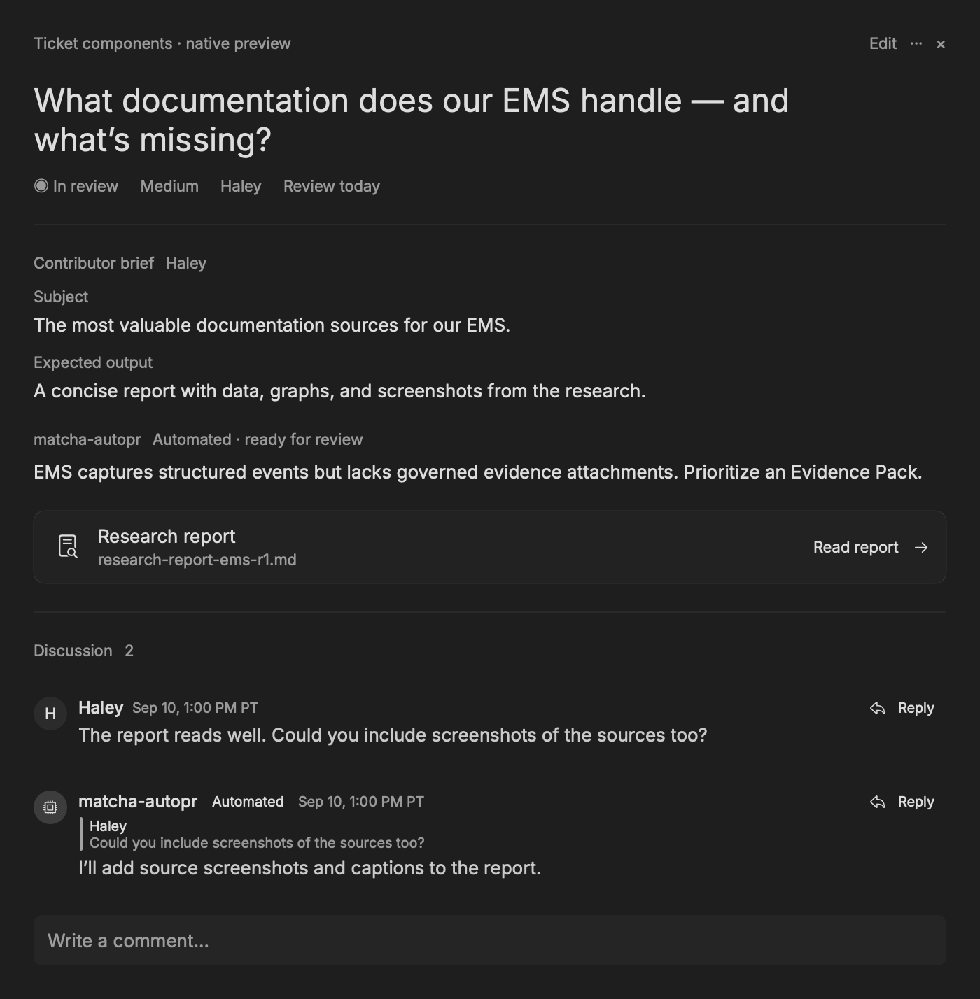
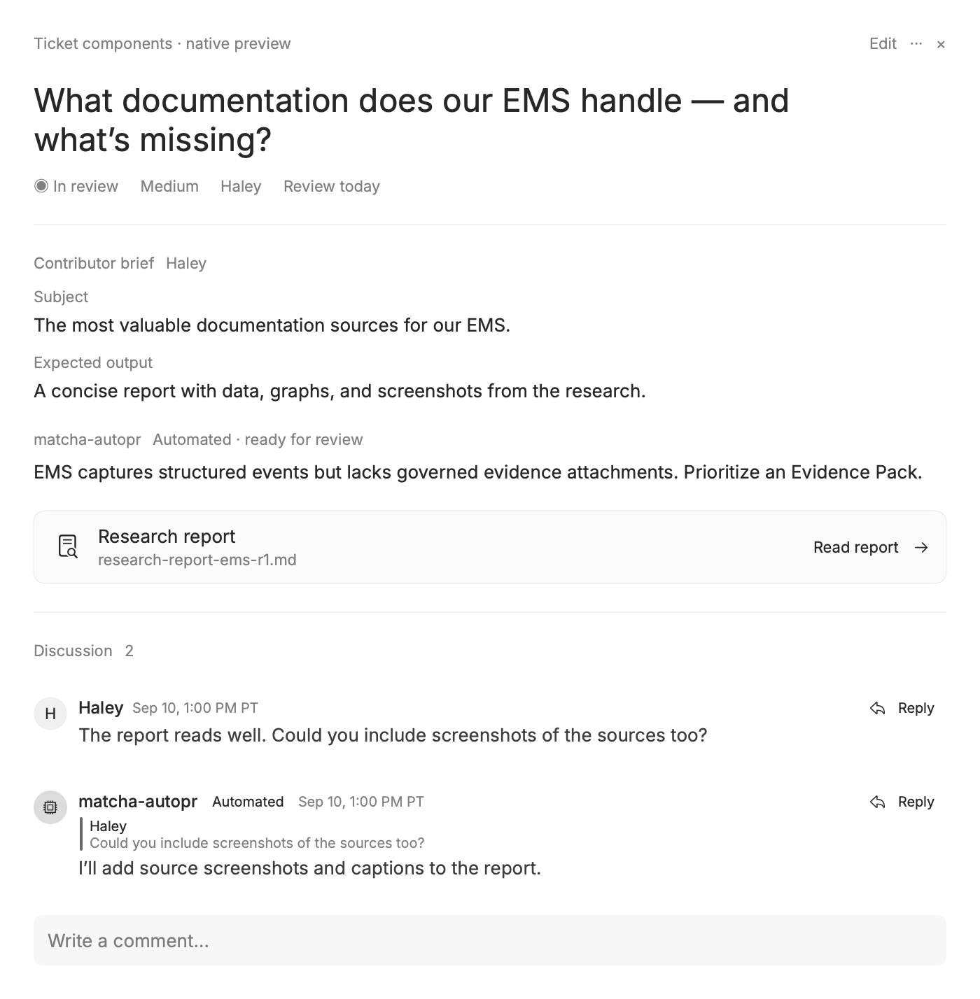
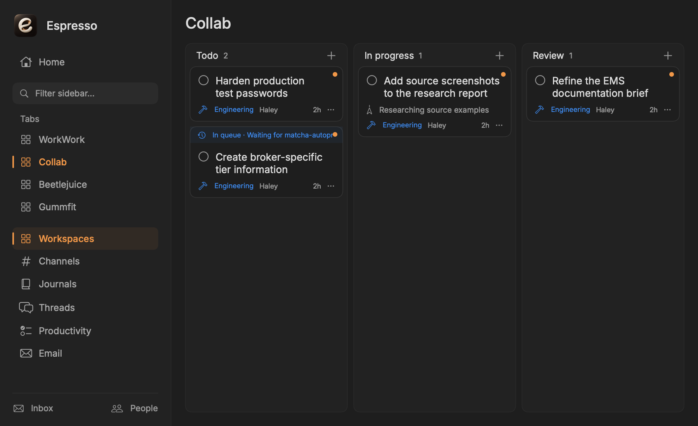
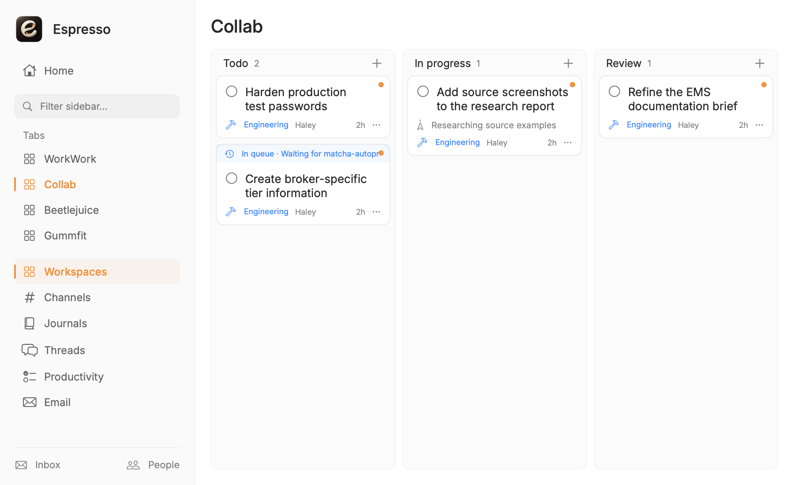

# Espresso ticket design

Native macOS design refresh: bundled Inter, regular-weight headings, a single reading surface, source-attributed updates, content-sized replies, persistent review actions, quieter navigation, and compact unopened kanban cards. No API, queue, or report-generation behavior changes.

## Assets

- Inter is copied unchanged from `platforms/ios/TellUs/Resources/Fonts/Inter.ttf` and bundled with its [SIL Open Font License](https://github.com/rsms/inter/blob/master/LICENSE.txt) in `Espresso/Resources/Fonts/OFL.txt`.
- App icon: `Espresso/Resources/Assets.xcassets/AppIcon.appiconset/app_icon_1024.png` and `app_icon_512.png`, mechanically resized from one image generated with the built-in image-generation tool. The original alpha is preserved.

### Final icon prompt

Use case: logo-brand. Asset type: production macOS application icon for Espresso, a minimal collaborative work app. Create one finished square icon, not a presentation or sheet of variants. Primary request: an elegant, cool, iconic sculptural lowercase e formed from one thick continuous ivory ceramic ribbon with a small warm copper interior glint; its curved silhouette subtly suggests a swirl of espresso crema, but no literal coffee cup or saucer. A bold extremely simple silhouette legible at 32 pixels, precise generous negative space. Center the sculptural e on a deep espresso-black rounded-square macOS tile, very subtle warm satin surface, restrained soft light from upper left, slight realistic depth, polished premium industrial design. The tile occupies approximately 88% of the canvas with standard macOS rounded corners and a delicate shadow. Genuinely transparent pixels outside the rounded tile. Front-facing straight-on orthographic composition; no perspective tilt. Warm ivory and espresso tones with a small copper reflection. No words, no caption, no watermark, no ornate bevel border, no sparkles, no decorative objects. 1024 by 1024 square image. Make the one e-mark the unmistakable focal point.

## Validation

```sh
./scripts/xcode-build.sh espresso build
python3 scripts/tests/test_espresso_ticket_design.py /tmp/espresso-ticket-design-previews
git diff --check
```

The offline native smoke test compiles the production typography, brief renderer, discussion row, and research-report entry. It verifies font registration, quote/empty-note sizing, compact card design contracts, and sidebar theme alignment. It renders fixture-based ticket and workspace previews in light and dark themes. These are component previews, not signed-in end-to-end screenshots. The production build covers integration with the full ticket viewer and board; live queue/review mutations are intentionally not exercised against production.

### Component previews








